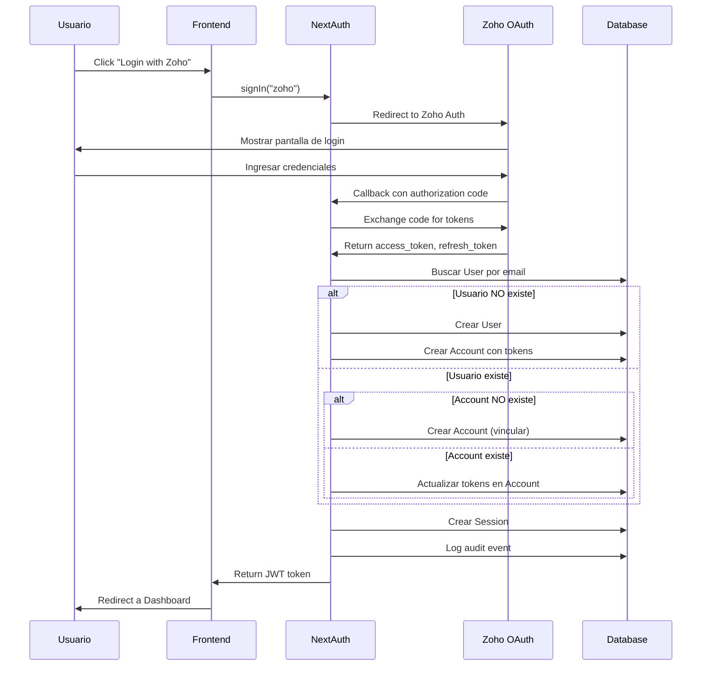
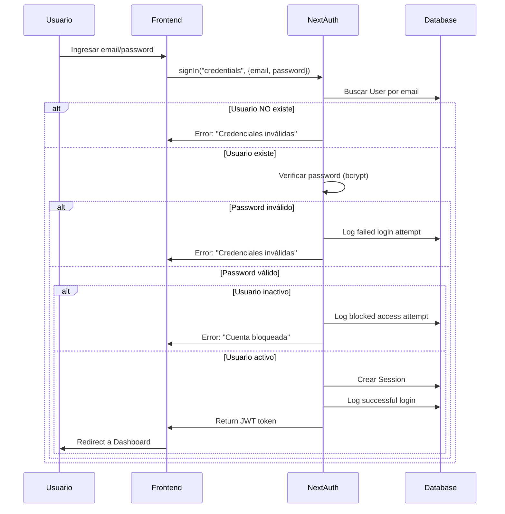
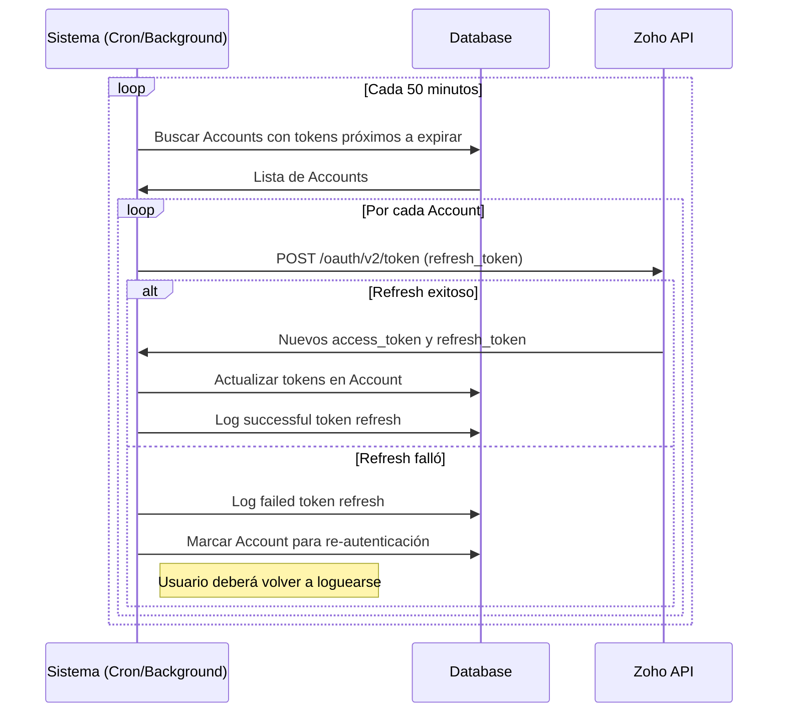

# 🔐 Arquitectura de Autenticación - Sistema Híbrido

## 📋 Índice

1. [Visión General](#visión-general)
2. [Diagrama de Flujo](#diagrama-de-flujo)
3. [Modelo de Datos](#modelo-de-datos)
4. [Flujos de Autenticación](#flujos-de-autenticación)
5. [Gestión de Tokens](#gestión-de-tokens)
6. [Casos de Uso](#casos-de-uso)

---

## 🎯 Visión General

Sistema de autenticación híbrido que soporta:

- **Autenticación por Credenciales** (email/password)
- **OAuth 2.0 con Zoho** (Single Sign-On)
- **Vinculación de cuentas** cuando el email coincide
- **Refresh automático de tokens** para mantener sesión activa

### Principios de Diseño

1. **Separación de Responsabilidades**: User (identidad) vs Account (método de auth)
2. **Extensibilidad**: Fácil agregar nuevos providers OAuth
3. **Seguridad**: Almacenamiento seguro de tokens, auditoría de eventos
4. **Resilencia**: Manejo robusto de expiración y refresh de tokens

---

## 📊 Diagrama de Flujo

### Flujo de Autenticación Zoho OAuth



### Flujo de Autenticación por Credenciales



### Flujo de Refresh Token (Zoho)



---

## 🗄️ Modelo de Datos

### Tabla: `User`

**Propósito**: Identidad del usuario, independiente del método de autenticación

| Campo           | Tipo            | Descripción                          |
| --------------- | --------------- | ------------------------------------ |
| `id`            | CUID            | ID único del usuario                 |
| `email`         | String (unique) | Email del usuario                    |
| `name`          | String?         | Nombre completo                      |
| `password`      | String?         | Hash bcrypt (solo para credenciales) |
| `image`         | String?         | URL de foto de perfil                |
| `role`          | Enum            | ADMIN \| SELLER                      |
| `country`       | String?         | País del usuario                     |
| `isActive`      | Boolean         | Estado de la cuenta                  |
| `emailVerified` | DateTime?       | Fecha de verificación                |

### Tabla: `Account`

**Propósito**: Método de autenticación vinculado al usuario

| Campo                | Tipo        | Descripción                  |
| -------------------- | ----------- | ---------------------------- |
| `id`                 | CUID        | ID único de la cuenta        |
| `userId`             | String (FK) | Referencia a User            |
| `provider`           | String      | "zoho" \| "credentials"      |
| `providerAccountId`  | String      | ZUID de Zoho                 |
| `access_token`       | Text?       | Token de acceso OAuth        |
| `refresh_token`      | Text?       | Token de refresh OAuth       |
| `expires_at`         | Int?        | Unix timestamp de expiración |
| `api_domain`         | String?     | Dominio API de Zoho          |
| `zoho_org_id`        | String?     | Organization ID              |
| `token_refreshed_at` | DateTime?   | Última actualización         |

### Tabla: `Session`

**Propósito**: Sesión JWT activa del usuario

| Campo          | Tipo            | Descripción           |
| -------------- | --------------- | --------------------- |
| `sessionToken` | String (unique) | Token de sesión       |
| `userId`       | String (FK)     | Referencia a User     |
| `expires`      | DateTime        | Fecha de expiración   |
| `ipAddress`    | String?         | IP de origen          |
| `userAgent`    | String?         | Navegador/dispositivo |

### Tabla: `AuthAuditLog`

**Propósito**: Auditoría de eventos de autenticación

| Campo      | Tipo    | Descripción                       |
| ---------- | ------- | --------------------------------- |
| `event`    | String  | LOGIN_SUCCESS, TOKEN_REFRESH, etc |
| `userId`   | String? | Usuario involucrado               |
| `email`    | String? | Email del evento                  |
| `provider` | String? | Proveedor usado                   |
| `metadata` | JSON?   | Datos adicionales                 |

---

## 🔄 Flujos de Autenticación

### 1. Login con Zoho (Primera vez)

```typescript
// Pseudocódigo
async function handleZohoLogin(profile, tokens) {
  // 1. Buscar o crear usuario
  let user = await db.user.findUnique({ where: { email: profile.Email } });

  if (!user) {
    user = await db.user.create({
      data: {
        email: profile.Email,
        name: `${profile.First_Name} ${profile.Last_Name}`,
        image: profile.ProfileImage,
        emailVerified: new Date(),
      },
    });
  }

  // 2. Crear o actualizar Account de Zoho
  await db.account.upsert({
    where: {
      provider_providerAccountId: {
        provider: "zoho",
        providerAccountId: profile.ZUID,
      },
    },
    create: {
      userId: user.id,
      type: "oauth",
      provider: "zoho",
      providerAccountId: profile.ZUID,
      access_token: tokens.access_token,
      refresh_token: tokens.refresh_token,
      expires_at: Math.floor(Date.now() / 1000) + tokens.expires_in,
      api_domain: profile.accounts_server,
      zoho_org_id: profile.Organization_Id,
      token_refreshed_at: new Date(),
    },
    update: {
      access_token: tokens.access_token,
      refresh_token: tokens.refresh_token,
      expires_at: Math.floor(Date.now() / 1000) + tokens.expires_in,
      token_refreshed_at: new Date(),
    },
  });

  // 3. Log evento
  await db.authAuditLog.create({
    data: {
      userId: user.id,
      email: user.email,
      event: "LOGIN_SUCCESS",
      provider: "zoho",
      metadata: { userId: profile.ZUID },
    },
  });

  return user;
}
```

### 2. Login con Credenciales

```typescript
async function handleCredentialsLogin(email, password) {
  // 1. Buscar usuario
  const user = await db.user.findUnique({ where: { email } });

  if (!user || !user.password) {
    await logFailedAttempt(email, "INVALID_CREDENTIALS");
    throw new Error("Credenciales inválidas");
  }

  // 2. Verificar contraseña
  const isValid = await bcrypt.compare(password, user.password);

  if (!isValid) {
    await logFailedAttempt(email, "INVALID_PASSWORD");
    throw new Error("Credenciales inválidas");
  }

  // 3. Verificar estado
  if (!user.isActive) {
    await logFailedAttempt(email, "ACCOUNT_BLOCKED");
    throw new Error("Cuenta bloqueada");
  }

  // 4. Log evento exitoso
  await db.authAuditLog.create({
    data: {
      userId: user.id,
      email: user.email,
      event: "LOGIN_SUCCESS",
      provider: "credentials",
    },
  });

  return user;
}
```

---

## 🔄 Gestión de Tokens

### Estrategia de Refresh

**Problema**: Los access tokens de Zoho expiran cada 1 hora.

**Solución**: Job programado que refresca tokens antes de expirar.

```typescript
// api/cron/refresh-tokens.ts
export async function refreshExpiredTokens() {
  // 1. Buscar tokens que expiran en los próximos 10 minutos
  const expiringAccounts = await db.account.findMany({
    where: {
      provider: "zoho",
      refresh_token: { not: null },
      expires_at: {
        lte: Math.floor(Date.now() / 1000) + 600, // 10 min
      },
    },
    include: { user: true },
  });

  // 2. Refrescar cada token
  for (const account of expiringAccounts) {
    try {
      const response = await fetch("https://accounts.zoho.com/oauth/v2/token", {
        method: "POST",
        headers: { "Content-Type": "application/x-www-form-urlencoded" },
        body: new URLSearchParams({
          refresh_token: account.refresh_token!,
          client_id: process.env.ZOHO_CLIENT_ID!,
          client_secret: process.env.ZOHO_CLIENT_SECRET!,
          grant_type: "refresh_token",
        }),
      });

      const tokens = await response.json();

      if (tokens.access_token) {
        // Actualizar tokens
        await db.account.update({
          where: { id: account.id },
          data: {
            access_token: tokens.access_token,
            expires_at: Math.floor(Date.now() / 1000) + tokens.expires_in,
            token_refreshed_at: new Date(),
          },
        });

        // Log exitoso
        await db.authAuditLog.create({
          data: {
            userId: account.userId,
            event: "TOKEN_REFRESH_SUCCESS",
            provider: "zoho",
          },
        });
      }
    } catch (error) {
      // Log fallo
      await db.authAuditLog.create({
        data: {
          userId: account.userId,
          event: "TOKEN_REFRESH_FAILED",
          provider: "zoho",
          metadata: { error: error.message },
        },
      });
    }
  }
}
```

### Configuración del Cron Job

```typescript
// Vercel Cron o similar
// vercel.json
{
  "crons": [{
    "path": "/api/cron/refresh-tokens",
    "schedule": "*/50 * * * *" // Cada 50 minutos
  }]
}
```

---

## 📝 Casos de Uso

### Caso 1: Usuario nuevo se registra con Zoho

1. Usuario hace click en "Login with Zoho"
2. Zoho autentica y devuelve tokens
3. Sistema crea User y Account
4. Usuario accede al dashboard

### Caso 2: Usuario existente (credenciales) vincula Zoho

1. Usuario logueado con credenciales
2. Usuario hace click en "Connect Zoho"
3. Sistema busca User por email
4. Sistema crea Account de Zoho vinculado
5. Usuario ahora puede entrar con ambos métodos

### Caso 3: Token de Zoho expira durante sesión

1. Job de cron detecta token próximo a expirar
2. Job usa refresh_token para obtener nuevo access_token
3. Sistema actualiza Account en DB
4. Usuario no experimenta interrupción

### Caso 4: Refresh token inválido (usuario cambió contraseña en Zoho)

1. Job de cron intenta refrescar
2. Zoho rechaza el refresh_token
3. Sistema marca Account con flag de re-autenticación
4. Próximo intento de acceso fuerza nuevo login con Zoho

---

## 🔒 Consideraciones de Seguridad

1. **Almacenamiento de Tokens**: Encriptados en reposo (campo Text en DB)
2. **Rotación de Secrets**: `NEXTAUTH_SECRET` debe rotarse periódicamente
3. **Rate Limiting**: Limitar intentos de login fallidos
4. **Audit Logs**: Todos los eventos de auth son registrados
5. **Scopes Mínimos**: Solo solicitar permisos necesarios de Zoho
6. **HTTPS Only**: Todas las comunicaciones sobre TLS

---

## 🚀 Próximos Pasos

- [ ] Implementar refresh token job
- [ ] Agregar UI para vincular/desvincular cuentas
- [ ] Dashboard de auditoría de seguridad
- [ ] Soporte para MFA (Multi-Factor Authentication)
- [ ] Agregar más providers OAuth (Google, Microsoft)
